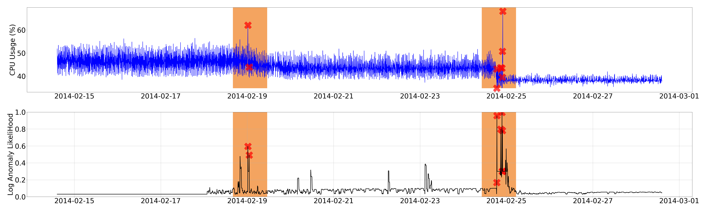

# An Anomaly Detection System Based on Unsupervised Learning in IoT Environment

## Introduction
This project is the basic design, implementation and prove of concept ot an IoT Management and Anomaly Detection System, based on the study [An Anomaly Detection System Based on Unsupervised Learning in IoT Environment](https://doi.org/10.6844/NCKU202100373).
## Abstract

近年隨著半導體、網路通訊之迅速發展，使物聯網系統的應用蓬勃發展。物聯網系統的運作與效益，仰賴其內部眾多感測器所產生的大量數據資料。對蒐集之資料進行進一步的資料分析，例如：視覺資料辨識、語音辨識、安全等級評估、異常偵測與預警等等，使物聯網系統的應用範圍與功能性提高。其中，異常偵測與預警是物聯網結合數據資料分析領域中的重要應用。

本論文透過研究物聯網架構與異常偵測演算法，設計可適用於非特定場域，以提供異常偵測功能之物聯網管理系統。本論文研究與設計之重點包含：(1)採用RESTful設計風格之管理系統，以增加本系統之管理性；(2)異常偵測部分採用模組化介面設計，目的為提供本物聯網系統內多樣化之異常偵測演算法同時運行之設計；(3)服務與管理群組的功能，以及多感測器情境的設計。本系統內可存在多種多個感測器，透過群組管理以及多工管理設計可達到多重感測器協同運行以及複數異常偵測演算法同時運作。

為驗證本系統之設計可用性，本論文研究目前常見異常偵測演算法之運行模式與架構，並考量物聯網環境資料特性，選擇適用於無標籤資料並可串流運作之機器學習演算法：階層式時序性記憶模型(Hierarchical Temporal Memory, HTM)作為本論文異常偵測驗證之範例模型。

本論文主要貢獻為一非監督式異常偵測系統暨物聯網管理系統，此系統可應用於不同場域，並針對該場域進行客製化設定；且選用之範例異常偵測模型在無須提供複雜環境設定下即可針對該場域之數據特性進行自動學習與判斷。模組化設計可在無須修改系統運作流程與實作的情況下，擴充本系統內之異常偵測演算法種類。實作採用容器化技術，可在僅增加微小運算成本的情況下，大幅提高系統可移植性與保證系統完整性。

**關鍵字：異常偵測、物聯網、非監督式學習**

Anomaly detection intents to find a set of unusual data points in seen data which might suggest system error, warning of critical status of system or rare situation that user attention is needed in order to response early or to handle properly so that further damage of system can be prevented. Traditional anomaly detection methods work fine with fixed dataset but might be unsuitable for datasets generated in IoT environment, which are in general streaming, heterogeneity in format, and concept drifting datasets. Requiring domain knowledge and resource constraints are also challenges in adopting classic anomaly detection methods in IoT application. Further, with the advances in the domain of nowadays widespread machine learning, achieving automatic and intelligent anomaly detection in IoT environment is highly desirable.

This study aims to design and implement a system capable of managing the devices in IoT environment and integrated with a anomaly detection system based on unsupervised machine learning technique. The main achievement and contribution of this study is a well-designed, fully working IoT management and anomaly detection system with the desirable features including REST (Representational State Transfer) user interfaces and a framework of anomaly detection functionality. For the purposes of demonstration and verification, a prototype system is built and tested. The results of testing cases showed that this system is able to manage the devices deployed in an IoT environment and detecting anomaly effectively. With the module of anomaly detection framework, this system is both flexible and expandable.

**Key words: Anomaly Detection, Internet of Thing, IoT, Unsupervised Learning.**


## Install and Evaluation
* Install (Require Root Privilege)

    ```
    $ cd Scripts/Setup
    $ ./install.sh
    ```

* Run Demo Scripts **Sequentially**(Require Jupyter Notebook)
    1. Run [Scripts/Demo/1.Setup_Env](./Scripts/Demo/1.Setup_Env.ipynb), for demo IoT environment setup.
    2. Run [Scripts/Demo/2.Pseudo_Data_Input](./Scripts/Demo/2.Pseudo_Data_Input.ipynb) for simulate sensor sensing envoronment, and transfer data into AIOT-CORE, and detecting anomaly.
    3. After all data in Step 2. ran out (it may take from hours to days), Run [Scripts/Demo/3.Plot](./Scripts/Demo/3.Plot.ipynb) to get graphical result. 
    

* Uninstall (Require Root Privilege)

    ```
    $ cd Scripts/Setup
    $ ./uninstall.sh
    ```

## Reference
* [FIWARE](https://github.com/telefonicaid/fiware-orion)
* [Numenta Anomaly Benchmark](https://github.com/numenta/NAB)
* [NUPIC](https://github.com/numenta/nupic)
